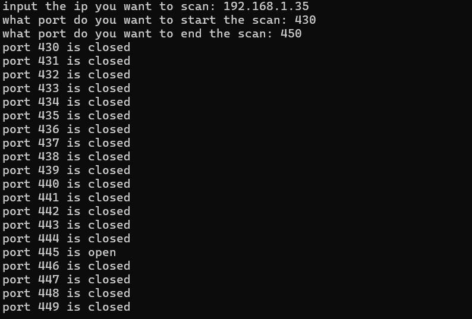

# Simple Python TCP Port Scanner

## Features

- TCP port scanning
- Detects open/closed ports
- Custom port ranges
- Built using Python sockets

## Technologies Used

- Python 3
- socket module
- TCP networking

## Usage

## Usage

```bash
python3 port_scanner.py
```

Example input:

```text
Input the IP you want to scan: 192.168.1.35
Start port: 1
End port: 100
```

## Example Scan


## What I Learned

- Python socket programming
- TCP connection handling
- Port scanning fundamentals
- Basic networking concepts

## Future Improvements

- Multithreading
- Banner grabbing
- Service detection
- Command-line argument support
- UDP scanning